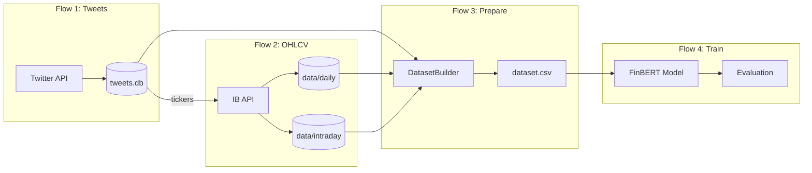
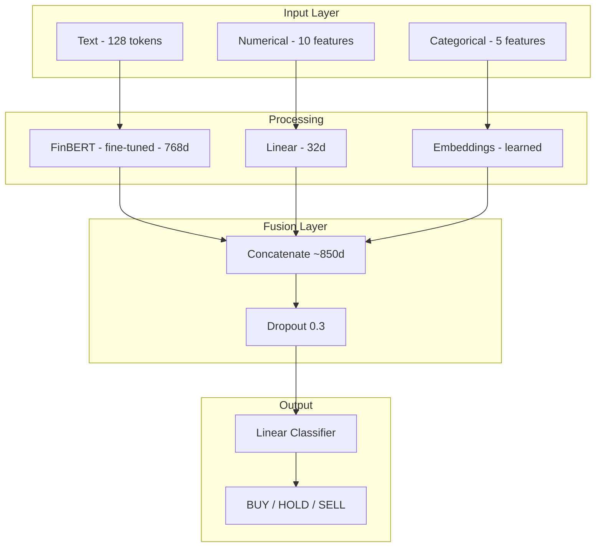

# FinTweet-ML

End-to-end ML pipeline for financial tweet sentiment classification using FinBERT.

[](https://www.python.org/downloads/)
[](https://pytorch.org/)
[](https://huggingface.co/yiyanghkust/finbert-tone)
[](https://opensource.org/licenses/MIT)

---

## Overview

FinTweet-ML demonstrates a complete ML workflow for predicting stock movements from financial social media:

| Component | Description |
|-----------|-------------|
| **Data Collection** | Twitter API + Interactive Brokers OHLCV |
| **Feature Engineering** | Technical indicators, market context, text processing |
| **Model** | Multi-modal FinBERT with full fine-tuning |
| **Evaluation** | Temporal validation, trading metrics |

### Key Results (V1 Model @ 70% Confidence)

| Metric | Value |
|--------|-------|
| Test Accuracy | **42.3%** (vs 33.3% random) |
| Information Coefficient | **0.070** (p=0.007) ✅ |
| Directional Accuracy | **53.6%** |
| Sharpe Ratio | **0.13** |
| Annual Return | **+9.1%** |

> **Key Finding**: Filtering to high-confidence predictions doubles IC from 0.034 → 0.070

---

## Pipeline Architecture



### Model Architecture



---

## Features

### Data Pipeline
- **Multi-source ingestion**: Twitter API, Interactive Brokers
- **Timezone handling**: UTC → US Eastern with DST support
- **Look-ahead bias prevention**: Strict temporal feature computation
- **Data leakage checks**: Automated validation scripts

### ML Training
- **Pre-trained FinBERT**: Financial domain knowledge with full fine-tuning
- **Multi-modal fusion**: Text + numerical + categorical features
- **Temporal splits**: 80/10/10 for realistic evaluation
- **Confidence filtering**: High-confidence predictions (>40%) for trading

### Evaluation
- **Trading metrics**: Information Coefficient, directional accuracy
- **Walk-forward validation**: Tests generalization across time
- **Class-weighted loss**: Handles label imbalance

---

## Project Structure

```
FinTweet-ML/
├── src/
│   ├── tweet_enricher/      # Data pipeline (Flows 1-3)
│   │   ├── twitter/         # Twitter API client
│   │   ├── data/            # IBKR fetcher, caching
│   │   ├── core/            # Enrichment & dataset builder
│   │   └── market/          # Market session handling
│   │
│   └── tweet_classifier/    # ML training (Flow 4)
│       ├── model.py         # FinBERT architecture
│       ├── train.py         # Training script
│       ├── evaluate.py      # Metrics & evaluation
│       └── data/            # Data loading & splits
│
├── data/
│   ├── daily/               # Daily OHLCV cache (feather)
│   ├── intraday/            # Intraday cache (feather)
│   └── tweets.db            # SQLite tweet storage
│
├── scripts/
│   └── validate_dataset.py  # Data validation
│
├── tests/                   # Unit tests
├── notebooks/               # Demo notebooks
│
└── docs/
    ├── ARCHITECTURE.md      # System design
    ├── DATASET.md           # Data documentation
    └── RESULTS.md           # Training results
```

---

## Quick Start

### Installation

```bash
# Clone repository
git clone https://github.com/yourusername/FinTweet-ML.git
cd FinTweet-ML

# Create virtual environment
python -m venv venv
source venv/bin/activate

# Install package
pip install -e .
```

### CLI Commands

```bash
# Flow 1: Collect tweets
fintweet-ml twitter sync --months 6
fintweet-ml twitter status
fintweet-ml twitter export -o tweets.csv

# Flow 2: Collect OHLCV data (requires IBKR TWS)
fintweet-ml ohlcv sync --tweet-db data/tweets.db
fintweet-ml ohlcv status

# Flow 3: Prepare dataset (offline - no API needed!)
fintweet-ml prepare --tweets data/tweets.db --output output/dataset.csv

# Flow 4: Train and evaluate
fintweet-ml train --data output/dataset.csv --epochs 5 --evaluate-test
fintweet-ml evaluate --model models/final --data output/dataset.csv
```

---

## Documentation

| Document | Description |
|----------|-------------|
| [ARCHITECTURE.md](docs/ARCHITECTURE.md) | System design and components |
| [DATASET.md](docs/DATASET.md) | Data sources, features, labels |
| [RESULTS.md](docs/RESULTS.md) | Training experiments, metrics, and confidence analysis |

---

## Key Findings

1. **Confidence filtering is critical** - IC doubles (0.034 → 0.070) when filtering to >70% confidence
2. **Better accuracy ≠ Better trading** - V3 has highest accuracy but worst trading metrics
3. **Temporal splits are essential** - Random splits overestimate performance significantly
4. **Full fine-tuning beats frozen BERT** - For trading signals, V1 (full) outperforms V2 (frozen)
5. **Statistical significance matters** - Only V1 has significant IC (p < 0.05) at high confidence

---

## Technologies

- **Python 3.11+**
- **PyTorch 2.0+** - Deep learning framework
- **Transformers** - Hugging Face for FinBERT
- **pandas / pandas-ta** - Data processing & technical indicators
- **Interactive Brokers API** - Market data
- **SQLite** - Tweet storage

---

## License

MIT License - see [LICENSE](LICENSE) for details.

---

## Author

Michael Zuskin

*Part of my ML Portfolio - demonstrating end-to-end ML pipeline development.*
