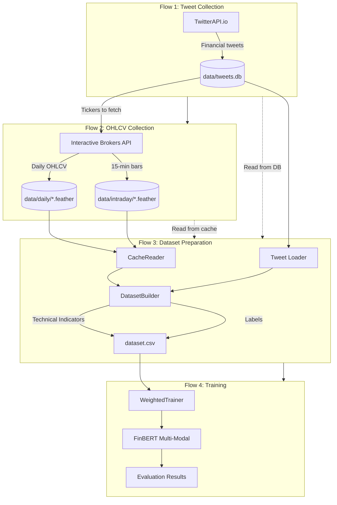
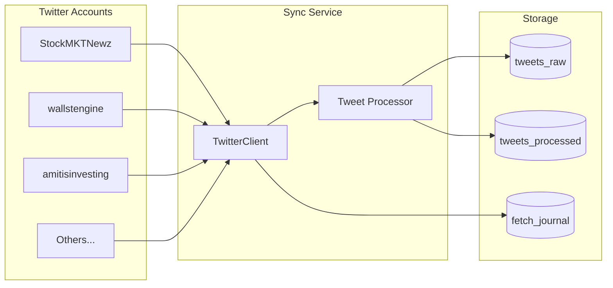
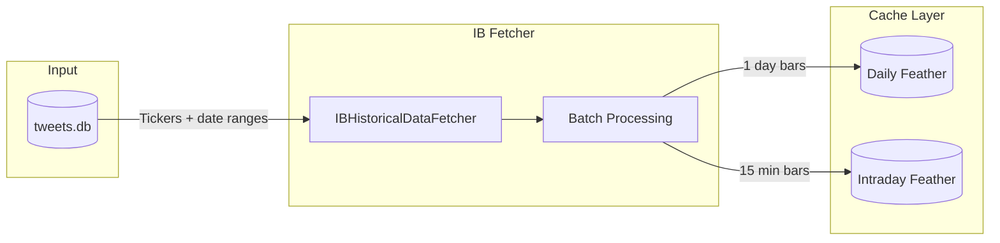
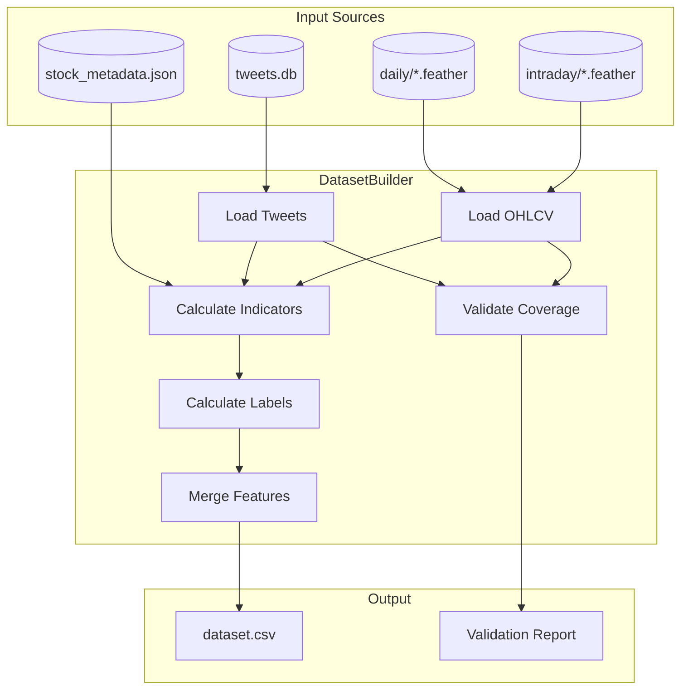
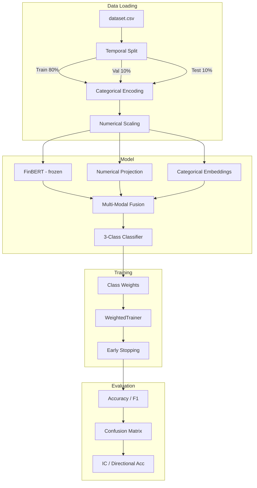
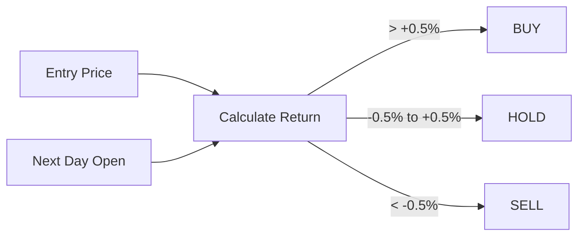
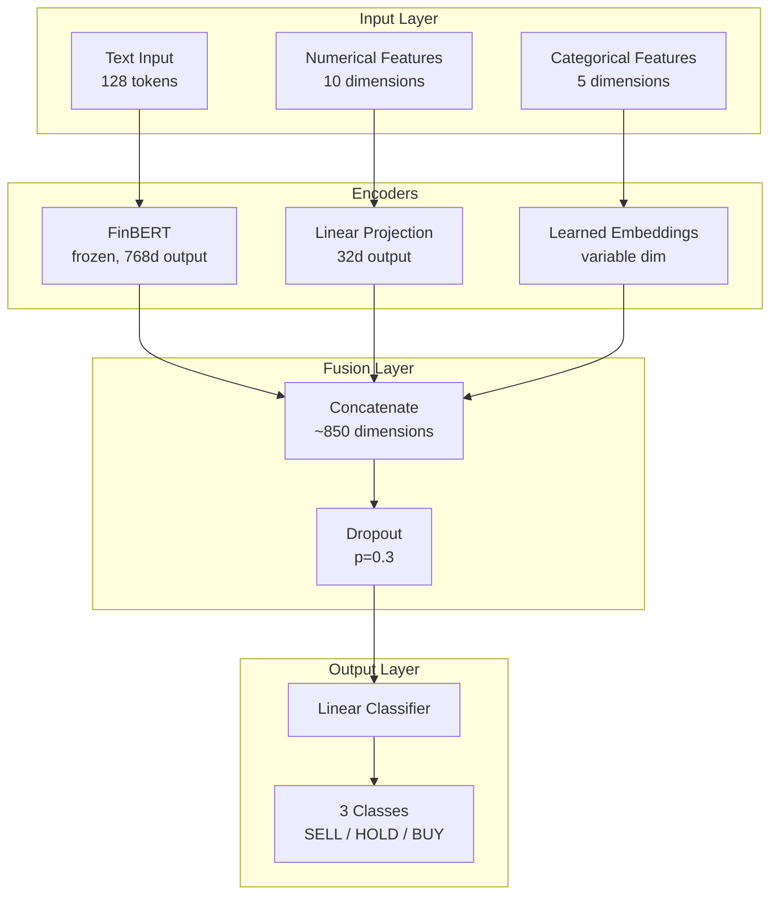
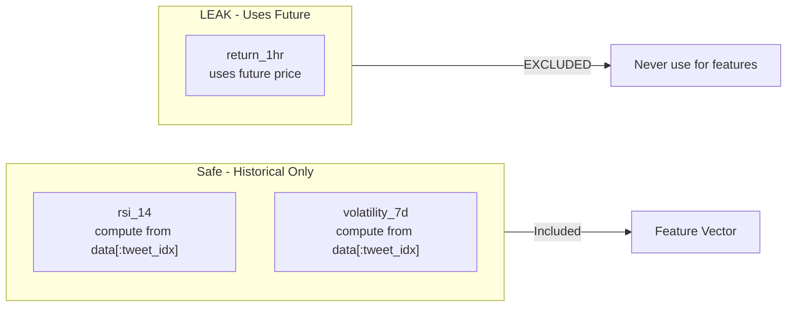
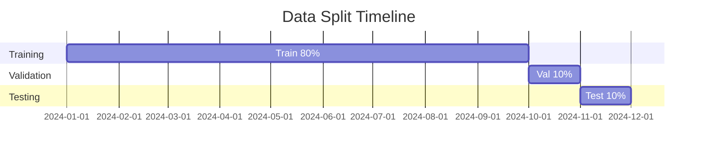

# Architecture Documentation

## System Overview

FinTweet-ML is an end-to-end ML pipeline for financial sentiment analysis, organized into 4 decoupled flows:

1. **Flow 1: Tweet Collection** - Twitter API sync (`fintweet-ml twitter`)
2. **Flow 2: OHLCV Collection** - IB API data fetching (`fintweet-ml ohlcv`)
3. **Flow 3: Dataset Preparation** - Offline processing (`fintweet-ml prepare`)
4. **Flow 4: Training & Evaluation** - Model training (`fintweet-ml train/evaluate`)



---

## CLI Commands

### Flow 1: Tweet Collection

```bash
# Sync tweets from configured Twitter accounts
fintweet-ml twitter sync                    # Incremental sync
fintweet-ml twitter sync --months 6         # Historical backfill
fintweet-ml twitter sync --estimate         # Estimate time/cost

# Check sync status
fintweet-ml twitter status

# Export tweets to CSV
fintweet-ml twitter export -o tweets.csv --since 2025-01-01
```

### Flow 2: OHLCV Data Collection

```bash
# Sync OHLCV data for all tickers in tweet database (plus SPY)
fintweet-ml ohlcv sync --tweet-db data/twitter/tweets.db
fintweet-ml ohlcv sync --tweet-db tweets.db --since 2024-01-01
fintweet-ml ohlcv sync --tweet-db tweets.db --daily-only

# Check cache status
fintweet-ml ohlcv status --details
```

### Flow 3: Dataset Preparation (Offline)

```bash
# Prepare training dataset from cached data (NO API calls!)
fintweet-ml prepare --tweets data/tweets.db --output output/dataset.csv
fintweet-ml prepare --tweets tweets.csv --output dataset.csv --since 2025-01-01
```

### Flow 4: Training & Evaluation

```bash
# Train FinBERT model
fintweet-ml train --data output/dataset.csv --epochs 5
fintweet-ml train --data dataset.csv --freeze-bert --temporal-split --evaluate-test

# Evaluate trained model
fintweet-ml evaluate --model models/final --data output/dataset.csv
```

### Utility Commands

```bash
# Filter tickers by volume
fintweet-ml filter-volume --min-volume 1000000 --output filtered.csv
```

---

## Package Structure

```
src/
├── tweet_enricher/              # Data Pipeline (Flows 1-3)
│   ├── cli.py                   # Unified CLI entry point
│   ├── config.py                # Configuration constants
│   ├── core/
│   │   ├── enricher.py          # Legacy enrichment (with IB calls)
│   │   ├── dataset_builder.py   # Offline dataset builder
│   │   └── indicators.py        # Technical indicators (pandas-ta)
│   ├── data/
│   │   ├── ib_fetcher.py        # IBKR API client (Flow 2)
│   │   ├── cache.py             # Read/write cache (with IB)
│   │   ├── cache_reader.py      # Read-only cache (Flow 3)
│   │   ├── stock_metadata.py    # Stock sector/market cap
│   │   └── tickers.py           # S&P500/Russell1000 lists
│   ├── twitter/
│   │   ├── client.py            # Twitter API client (Flow 1)
│   │   ├── database.py          # SQLite storage
│   │   └── sync.py              # Incremental sync
│   ├── io/
│   │   ├── feather.py           # Feather file I/O
│   │   └── csv_writer.py        # CSV output
│   └── market/
│       ├── session.py           # Market hours detection
│       └── regime.py            # Market regime classification
│
└── tweet_classifier/            # ML Training (Flow 4)
    ├── config.py                # Model configuration
    ├── model.py                 # FinBERT multi-modal architecture
    ├── dataset.py               # PyTorch dataset
    ├── train.py                 # Training script
    ├── trainer.py               # Custom trainer (weighted loss)
    ├── evaluate.py              # Evaluation metrics
    └── data/
        ├── loader.py            # Data loading
        ├── splitter.py          # Temporal splits
        └── weights.py           # Class weights
```

---

## Flow Details

### Flow 1: Tweet Collection



**Purpose:** Sync financial tweets from configured Twitter accounts.

**Components:**
- `TwitterClient` - TwitterAPI.io client
- `TweetDatabase` - SQLite storage (raw + processed tweets)
- `SyncService` - Incremental sync with cursor-based pagination

**Output:** SQLite database at `data/tweets.db`

### Flow 2: OHLCV Collection



**Purpose:** Fetch and cache historical OHLCV data from Interactive Brokers.

**Components:**
- `IBHistoricalDataFetcher` - Async IB API client
- `DataCache` - Manages disk/memory caching with incremental updates
- `save_daily_data/load_daily_data` - Feather file I/O

**Output:** Feather files in `data/daily/` and `data/intraday/`

### Flow 3: Dataset Preparation



**Key Feature:** NO external API calls - works entirely offline with cached data.

**Components:**
- `CacheReader` - Read-only access to feather cache
- `DatasetBuilder` - Processes tweets + OHLCV into enriched dataset
- `TechnicalIndicators` - Computes RSI, volatility, etc.
- `StockMetadataCache` - Sector and market cap lookups

### Flow 4: Training & Evaluation



**Purpose:** Train and evaluate FinBERT multi-modal classifier.

**Components:**
- `FinBERTMultiModal` - PyTorch model with frozen BERT + learned embeddings
- `WeightedTrainer` - Custom HuggingFace trainer with class weights
- `evaluate_model` - Full evaluation with confusion matrix

---

## Feature Engineering

| Feature Type | Examples | Source |
|--------------|----------|--------|
| **Price** | `entry_price`, `price_next_open` | IBKR intraday/daily |
| **Technical** | `rsi_14`, `volatility_7d`, `distance_from_ma_20` | pandas-ta |
| **Volume** | `relative_volume` | IBKR daily |
| **Context** | `market_regime`, `sector`, `market_cap_bucket` | Computed |
| **Session** | `session` (regular/premarket/afterhours/closed) | Market hours |
| **Text** | `text` (cleaned), `tweet_hash` | Twitter |

### Label Generation



```python
# 1-day forward return → 3-class label
return_1d = (price_next_open - entry_price) / entry_price

if return_1d > 0.005:    # > +0.5%
    label = "BUY"
elif return_1d < -0.005: # < -0.5%
    label = "SELL"
else:
    label = "HOLD"
```

---

## Model Architecture



### Key Design Decisions

| Decision | Choice | Rationale |
|----------|--------|-----------|
| Base Model | `yiyanghkust/finbert-tone` | Pre-trained on financial text |
| BERT Layers | **Frozen** | Prevents overfitting |
| Multi-modal | Text + Numerical + Categorical | Captures market context |
| Loss | Cross-entropy with class weights | Handles imbalance |
| Split | **Temporal** (80/10/10) | Prevents data leakage |

---

## Data Validation

### Look-Ahead Bias Prevention



### Temporal Split Strategy



---

## Design Principles

1. **Single Responsibility** - Each flow does ONE thing (Tweets, OHLCV, Prepare, Train)
2. **Offline-Capable** - Dataset preparation works without any API connections
3. **Reproducibility** - Same cache = same dataset every time
4. **Dependency Injection** - Components are injected for testability
5. **Configuration as Code** - All constants in dedicated config files
6. **Temporal Integrity** - Strict prevention of look-ahead bias
7. **Incremental Processing** - Support for resumable data fetching

---

## Configuration

### tweet_enricher/config.py

```python
ET = pytz.timezone("US/Eastern")
MARKET_OPEN = 9 * 60 + 30   # 9:30 AM ET
MARKET_CLOSE = 16 * 60      # 4:00 PM ET

DAILY_DATA_DIR = Path("data/daily")
INTRADAY_CACHE_DIR = Path("data/intraday")
TWITTER_DB_PATH = Path("data/tweets.db")

TWITTER_ACCOUNTS = [
    "StockMKTNewz", "wallstengine", ...
]
```

### tweet_classifier/config.py

```python
TARGET_COLUMN = "label_1d_3class"
LABEL_MAP = {"SELL": 0, "HOLD": 1, "BUY": 2}

NUMERICAL_FEATURES = [
    "volatility_7d", "rsi_14", "relative_volume", ...
]

CATEGORICAL_FEATURES = [
    "author", "category", "market_regime", ...
]
```
