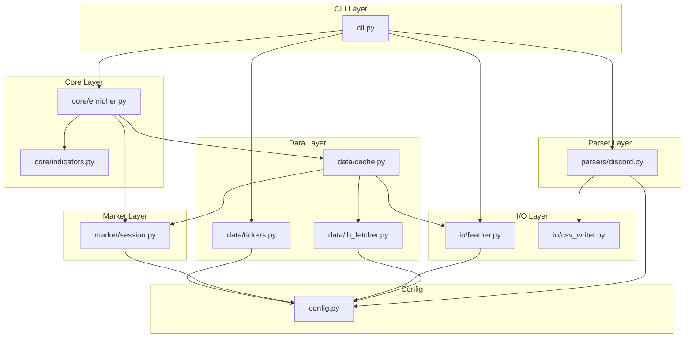
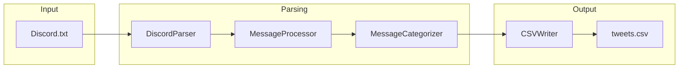
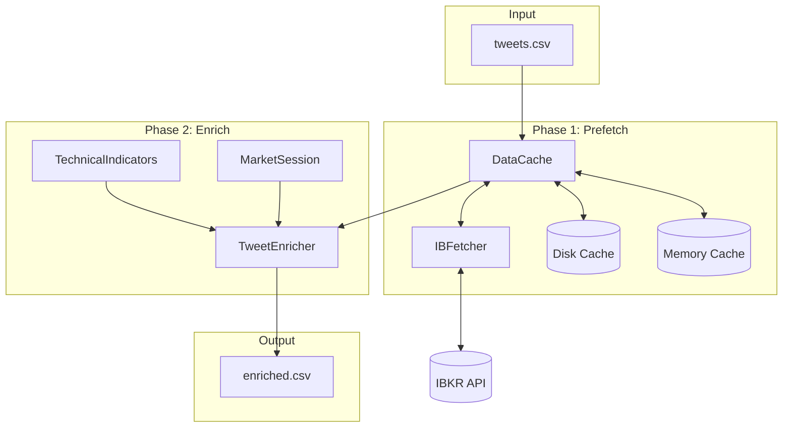
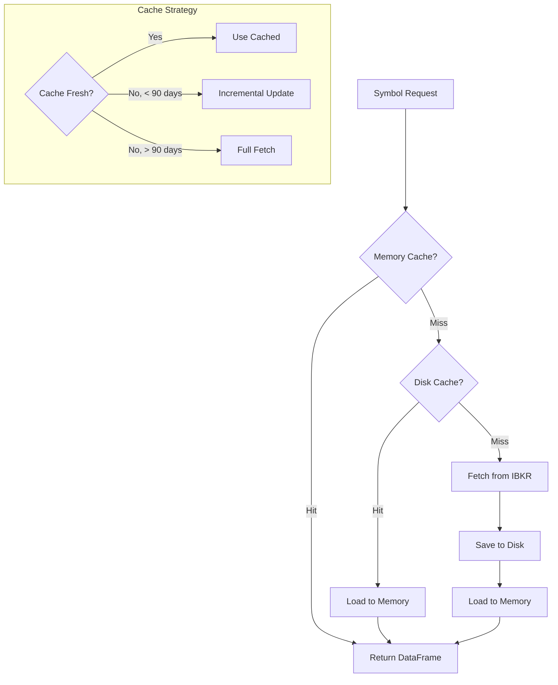
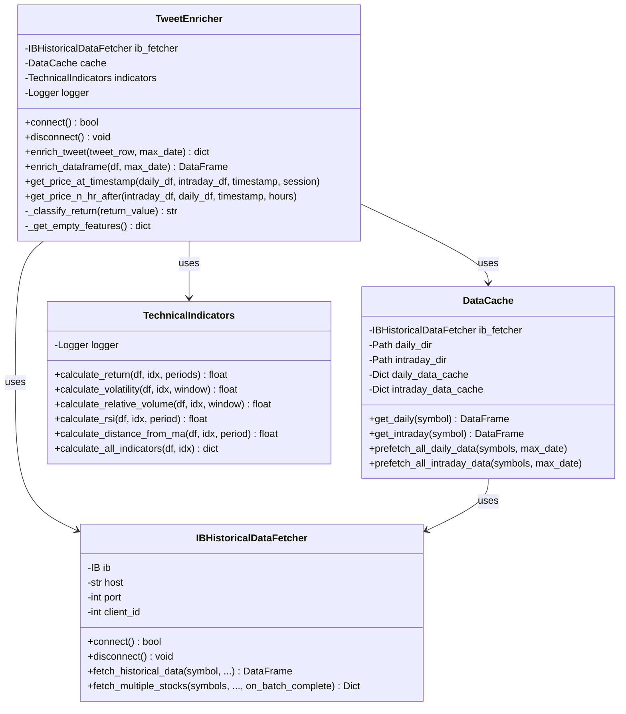
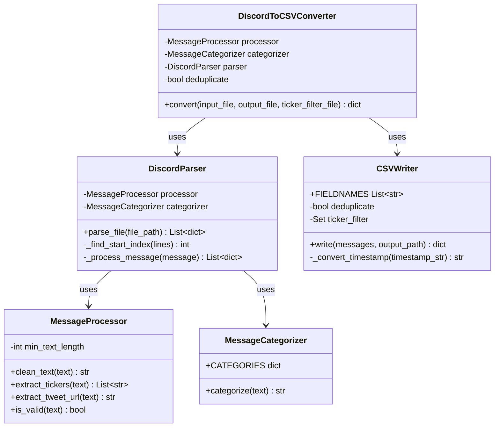

# Architecture Documentation

## Overview

**tweet_enricher** is a Python package for enriching financial tweet data with market indicators and price information from Interactive Brokers.

### Key Capabilities

1. **Discord Parsing** - Convert Discord channel exports into structured CSV with ticker extraction and categorization
2. **IBKR Data Fetching** - Fetch historical OHLCV data from Interactive Brokers with smart batching
3. **Tweet Enrichment** - Enrich tweets with technical indicators, price data, and market-adjusted returns
4. **Volume Filtering** - Filter ticker universes by average daily trading volume

### High-Level System Diagram

```
┌─────────────────────────────────────────────────────────────────────────────┐
│                         TWEET ENRICHER PIPELINE                              │
└─────────────────────────────────────────────────────────────────────────────┘

                              ┌──────────────┐
                              │   Discord    │
                              │  Export.txt  │
                              └──────┬───────┘
                                     │
                                     ▼
┌─────────────────────────────────────────────────────────────────────────────┐
│  STAGE 1: CONVERT                                                            │
│  ┌─────────────┐    ┌──────────────┐    ┌─────────────┐    ┌────────────┐  │
│  │DiscordParser│───▶│MessageProcess│───▶│ Categorizer │───▶│ CSVWriter  │  │
│  └─────────────┘    └──────────────┘    └─────────────┘    └────────────┘  │
└─────────────────────────────────────────────────────────────────────────────┘
                                     │
                                     ▼
                              ┌──────────────┐
                              │  tweets.csv  │
                              └──────┬───────┘
                                     │
                                     ▼
┌─────────────────────────────────────────────────────────────────────────────┐
│  STAGE 2: ENRICH                                                             │
│  ┌─────────────┐    ┌──────────────┐    ┌─────────────┐    ┌────────────┐  │
│  │  DataCache  │◀──▶│ IBFetcher    │    │ Indicators  │    │  Enricher  │  │
│  │ (disk+mem)  │    │ (IBKR API)   │    │ (pandas-ta) │    │            │  │
│  └─────────────┘    └──────────────┘    └─────────────┘    └────────────┘  │
└─────────────────────────────────────────────────────────────────────────────┘
                                     │
                                     ▼
                              ┌──────────────┐
                              │enriched.csv  │
                              │ + indicators │
                              │ + prices     │
                              │ + labels     │
                              └──────────────┘
```

---

## Package Structure

```
src/tweet_enricher/
├── __init__.py              # Package version
├── cli.py                   # Unified CLI with 4 subcommands
├── config.py                # Configuration constants
│
├── core/                    # Business Logic Layer
│   ├── __init__.py
│   ├── enricher.py          # TweetEnricher - main enrichment orchestrator
│   └── indicators.py        # TechnicalIndicators - pandas-ta wrapper
│
├── data/                    # Data Access Layer
│   ├── __init__.py
│   ├── ib_fetcher.py        # IBHistoricalDataFetcher - IBKR API client
│   ├── cache.py             # DataCache - memory + disk caching
│   └── tickers.py           # Ticker list fetching (S&P500, Russell1000)
│
├── parsers/                 # Input Parsing Layer
│   ├── __init__.py
│   └── discord.py           # Discord export parser and converter
│
├── io/                      # I/O Operations Layer
│   ├── __init__.py
│   ├── feather.py           # Feather file I/O for OHLCV data
│   └── csv_writer.py        # CSV writing with timezone conversion
│
└── market/                  # Market Utilities Layer
    ├── __init__.py
    └── session.py           # MarketSession enum and detection
```

### Layer Responsibilities

| Layer | Modules | Responsibility |
|-------|---------|----------------|
| **CLI** | `cli.py` | User interface, argument parsing, command dispatch |
| **Core** | `core/` | Business logic, enrichment algorithms, indicator calculation |
| **Data** | `data/` | External data fetching, caching strategies |
| **Parsers** | `parsers/` | Input file parsing and transformation |
| **I/O** | `io/` | File reading/writing, format conversion |
| **Market** | `market/` | Market session detection, timezone handling |
| **Config** | `config.py` | Constants, defaults, excluded tickers |

---

## Module Dependency Graph



---

## Data Flow Diagrams

### Flow 1: Discord Conversion Pipeline



**Process:**
1. `DiscordParser` reads raw Discord export, extracts timestamps and messages
2. `MessageProcessor` cleans text, extracts tickers (`$AAPL`), extracts tweet URLs
3. `MessageCategorizer` assigns one of 12 categories based on keywords
4. `CSVWriter` converts Jerusalem→ET timezone, deduplicates, writes CSV

### Flow 2: Tweet Enrichment Pipeline



**Process:**
1. Load tweets CSV, extract unique tickers
2. **Prefetch Phase**: For each ticker, check memory cache → disk cache → fetch from IBKR
3. **Enrich Phase**: For each tweet, calculate indicators using cached data
4. Output enriched CSV with 15+ additional columns

### Flow 3: Data Caching Strategy



**Caching Tiers:**
- **Memory Cache**: `Dict[str, pd.DataFrame]` - instant access, lost on restart
- **Disk Cache**: Feather files in `data/daily/` and `data/intraday/` - persistent
- **Incremental Updates**: Fetch only missing days, merge with existing cache

---

## Class Diagrams

### Core Classes



### Parser Classes



---

## Design Patterns

| Pattern | Where Used | Purpose |
|---------|------------|---------|
| **Dependency Injection** | `TweetEnricher.__init__()` | Inject `ib_fetcher`, `cache`, `indicators` for testability |
| **Repository Pattern** | `DataCache` | Abstract data access, hide caching details from consumers |
| **Strategy Pattern** | `MessageCategorizer` | Keyword-based categorization, easily add new categories |
| **Facade Pattern** | `DiscordToCSVConverter` | Simple interface hiding parser/processor/writer complexity |
| **Callback Pattern** | `fetch_multiple_stocks(on_batch_complete=...)` | Immediate batch processing for interrupt-safe saves |
| **Factory Pattern** | CLI `cmd_*` functions | Create appropriate handlers based on subcommand |

### Dependency Injection Example

```python
# Components are injected, not created internally
ib_fetcher = IBHistoricalDataFetcher(host, port, client_id)
cache = DataCache(ib_fetcher)
indicators = TechnicalIndicators()

enricher = TweetEnricher(
    ib_fetcher=ib_fetcher,  # Injected
    cache=cache,             # Injected
    indicators=indicators,   # Injected
)
```

**Benefits:**
- Easy to mock for unit testing
- Components can be replaced (e.g., different data source)
- Clear dependencies visible in constructor

---

## Configuration Reference

All configuration lives in `src/tweet_enricher/config.py`:

### Timezone
```python
ET = pytz.timezone("US/Eastern")  # All timestamps normalized to ET
```

### Market Hours (minutes since midnight, ET)
```python
PREMARKET_START = 4 * 60    # 4:00 AM
MARKET_OPEN = 9 * 60 + 30   # 9:30 AM
MARKET_CLOSE = 16 * 60      # 4:00 PM
AFTERHOURS_END = 20 * 60    # 8:00 PM
```

### Data Directories
```python
DAILY_DATA_DIR = Path("data/daily")       # Daily OHLCV cache
INTRADAY_CACHE_DIR = Path("data/intraday") # 15-min bar cache
```

### IB Connection Defaults
```python
DEFAULT_IB_HOST = "127.0.0.1"
DEFAULT_IB_PORT = 7497      # TWS default (Gateway: 4002)
DEFAULT_CLIENT_ID = 1
DEFAULT_BATCH_SIZE = 50
DEFAULT_BATCH_DELAY = 2.0   # seconds between batches
```

### Excluded Tickers
Tickers that consistently fail IBKR API calls:
- Class A/B shares: `BRK-B`, `BF-B`, `BF-A`, etc.
- Symbol issues: `LNW`, `DNB`, `K`, etc.
- Timeout issues: `WDAY`, `NDAQ`, `ABT`, etc.

---

## CLI Commands Reference

### Installation

```bash
pip install -e .
```

### Commands

#### `tweet-enricher convert`
Convert Discord export to structured CSV.

```bash
tweet-enricher convert -i input/discord/file.txt -o output/tweets.csv
tweet-enricher convert -i input.txt -o output.csv -f tickers.csv --min-length 100
```

| Option | Description |
|--------|-------------|
| `-i, --input` | Input Discord export file (required) |
| `-o, --output` | Output CSV file (required) |
| `-f, --filter` | Ticker filter CSV with `symbol` column |
| `--no-dedup` | Disable duplicate removal |
| `--min-length` | Minimum text length (default: 60) |

#### `tweet-enricher fetch`
Fetch historical OHLCV data from Interactive Brokers.

```bash
tweet-enricher fetch --sp500
tweet-enricher fetch --symbols AAPL MSFT GOOGL
tweet-enricher fetch --all --duration "1 Y"
```

| Option | Description |
|--------|-------------|
| `--symbols` | List of tickers |
| `--sp500` | Fetch all S&P 500 |
| `--russell1000` | Fetch all Russell 1000 |
| `--all` | Fetch both indices combined |
| `--duration` | Duration string (default: "1 Y") |
| `--bar-size` | Bar size (default: "1 day") |
| `--batch-size` | Symbols per batch (default: 200) |

#### `tweet-enricher enrich`
Enrich tweets with market data and indicators.

```bash
tweet-enricher enrich -i output/tweets.csv -o output/enriched.csv
tweet-enricher enrich -i tweets.csv -o enriched.csv --port 4002
```

| Option | Description |
|--------|-------------|
| `-i, --input` | Input tweets CSV (required) |
| `-o, --output` | Output enriched CSV (required) |
| `--host` | TWS/Gateway host (default: 127.0.0.1) |
| `--port` | TWS/Gateway port (default: 7497) |

#### `tweet-enricher filter-volume`
Filter tickers by average daily volume.

```bash
tweet-enricher filter-volume --min-volume 1000000
tweet-enricher filter-volume --min-volume 500000 --output filtered.csv
```

| Option | Description |
|--------|-------------|
| `--data-dir` | Directory with feather files |
| `--min-volume` | Minimum average volume (default: 1M) |
| `--output` | Output CSV file (optional) |

---

## Extension Points

### Adding New Message Categories

Edit `parsers/discord.py` → `MessageCategorizer.CATEGORIES`:

```python
CATEGORIES = {
    # Existing categories...
    "Your New Category": [
        "keyword1",
        "keyword2", 
        "your phrase",
    ],
}
```

### Adding New Technical Indicators

Edit `core/indicators.py` → `TechnicalIndicators`:

```python
def calculate_macd(self, df: pd.DataFrame, idx: int) -> Optional[float]:
    """Calculate MACD indicator."""
    subset = df.iloc[:idx + 1].copy()
    macd = ta.macd(subset["close"])
    # ... return value

def calculate_all_indicators(self, df, idx) -> dict:
    return {
        # Existing indicators...
        "macd": self.calculate_macd(df, idx),
    }
```

### Adding New Data Sources

Create new fetcher class implementing same interface:

```python
# data/alpha_vantage_fetcher.py
class AlphaVantageFetcher:
    async def fetch_historical_data(self, symbol, ...) -> pd.DataFrame:
        # Implement API call
        pass
    
    async def fetch_multiple_stocks(self, symbols, ...) -> Dict[str, pd.DataFrame]:
        # Implement batch fetching
        pass
```

Inject into `TweetEnricher` instead of `IBHistoricalDataFetcher`.

### Custom Caching Strategies

Subclass `DataCache` to implement different strategies:

```python
class RedisDataCache(DataCache):
    def __init__(self, redis_client, ib_fetcher):
        super().__init__(ib_fetcher)
        self.redis = redis_client
    
    def get_daily(self, symbol) -> Optional[pd.DataFrame]:
        # Check Redis first
        cached = self.redis.get(f"daily:{symbol}")
        if cached:
            return pd.read_json(cached)
        return super().get_daily(symbol)
```

---

## Error Handling Strategy

### Connection Failures (IBKR)

```python
async def connect(self) -> bool:
    try:
        await self.ib.connectAsync(...)
        return True
    except ConnectionRefusedError:
        self.logger.error("Connection refused. Ensure TWS/Gateway is running.")
        return False
    except Exception as e:
        self.logger.error(f"Connection error: {e}")
        return False
```

**Strategy:** Return `False` on failure, let caller decide how to proceed.

### Missing Data Handling

```python
if daily_df_full is None or daily_df_full.empty:
    self.logger.warning(f"No data available for {ticker}")
    return self._get_empty_features()  # Return dict with None values
```

**Strategy:** Return empty features dict, continue processing other tweets.

### Cache Invalidation

- **Daily data**: Invalidate if cache is >90 days stale → full refetch
- **Intraday data**: Invalidate if cache is >60 days stale → full refetch
- **Incremental**: If <90 days stale, fetch only missing days and merge

### Graceful Degradation

1. **No IBKR connection** → Use disk cache only
2. **No disk cache** → Skip ticker, log warning
3. **No intraday data** → Fall back to daily close price
4. **No SPY data** → Use unadjusted returns

```python
if spy_return_1hr is not None:
    return_1hr_adjusted = return_1hr - spy_return_1hr
else:
    return_1hr_adjusted = return_1hr  # Fallback: unadjusted
    self.logger.warning("Using unadjusted return (no SPY 1hr data)")
```

---

## Enrichment Output Schema

The enriched CSV includes these columns:

| Column | Type | Description |
|--------|------|-------------|
| `timestamp` | datetime | Tweet timestamp (ET) |
| `ticker` | string | Stock ticker symbol |
| `author` | string | Discord username |
| `category` | string | One of 12 categories |
| `session` | string | `regular`, `premarket`, `afterhours`, `closed` |
| `price_at_tweet` | float | Stock price at tweet time |
| `price_at_tweet_flag` | string | Data quality indicator |
| `price_1hr_after` | float | Stock price 1 hour after tweet |
| `price_1hr_after_flag` | string | Data quality indicator |
| `return_1hr` | float | 1-hour return (decimal) |
| `return_1hr_adjusted` | float | Market-adjusted 1-hour return |
| `label_5class` | string | `strong_sell`, `sell`, `hold`, `buy`, `strong_buy` |
| `return_1d` | float | Previous day return |
| `volatility_7d` | float | 7-day volatility |
| `relative_volume` | float | Volume vs 20-day average |
| `rsi_14` | float | 14-period RSI |
| `distance_from_ma_20` | float | Distance from 20-day MA |
| `spy_return_1d` | float | SPY previous day return |
| `spy_return_1hr` | float | SPY 1-hour return |
| `tweet_url` | string | Original tweet URL |
| `text` | string | Cleaned message text |

---

## Performance Characteristics

| Operation | Typical Performance |
|-----------|---------------------|
| Discord parsing | ~10,000 messages/second |
| IBKR fetch (daily) | ~5-10 symbols/second (API limit) |
| IBKR fetch (intraday) | ~2-3 symbols/second |
| Cache load (disk) | ~100 symbols/second |
| Enrichment (cached) | ~50-100 tweets/second |
| Full S&P 500 fetch | ~30-60 minutes |
| Full enrichment (6000 tweets) | ~2-3 minutes (with prefetch) |

### Optimization Techniques

1. **Batch fetching**: Fetch multiple symbols in parallel (up to batch_size)
2. **Prefetching**: Load all ticker data before processing tweets
3. **Feather format**: Fast binary format for disk cache
4. **Incremental updates**: Only fetch missing days, not full history
5. **Memory caching**: Avoid repeated disk reads during enrichment

