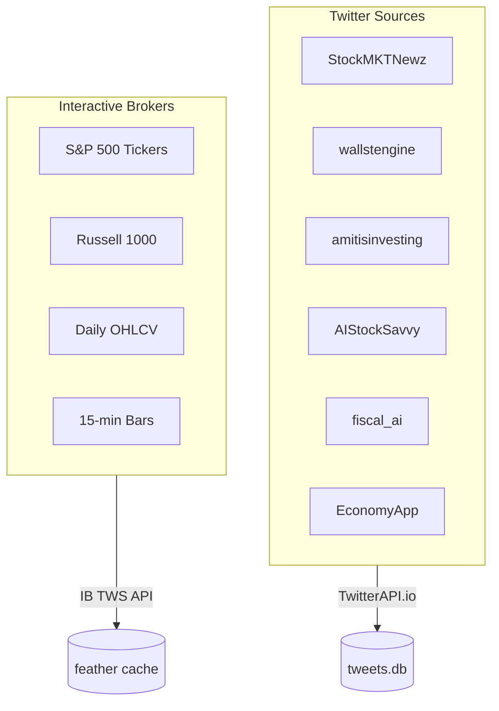
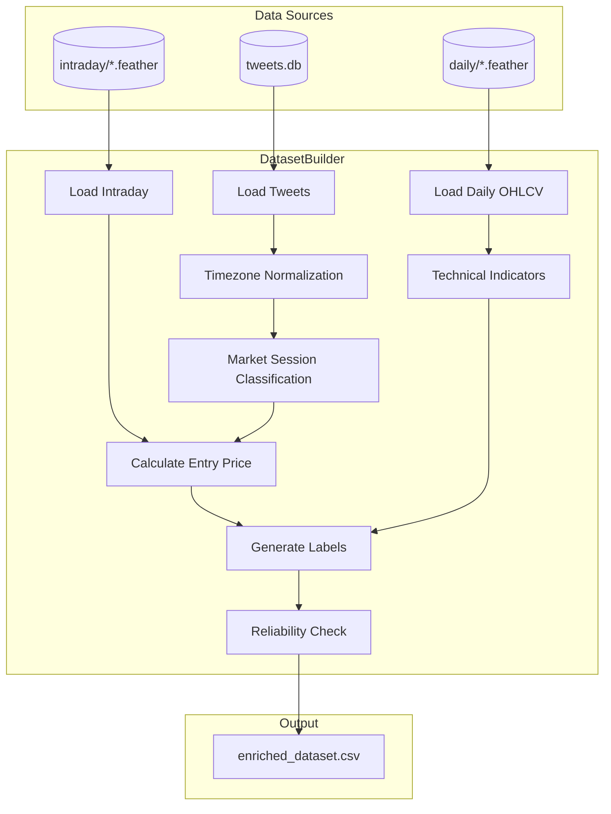
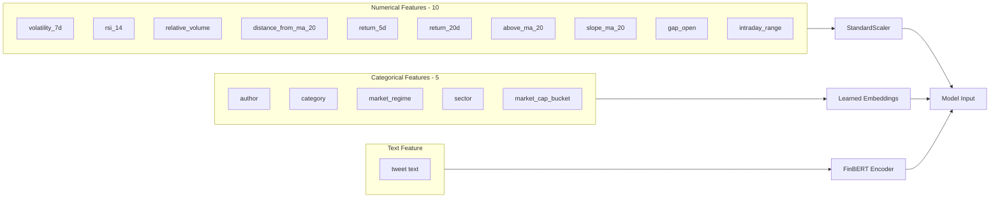
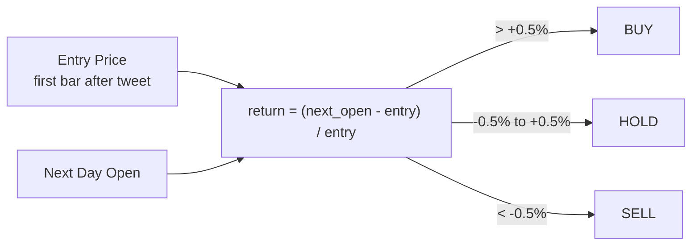
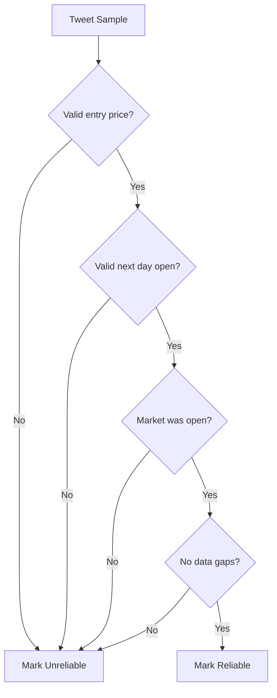
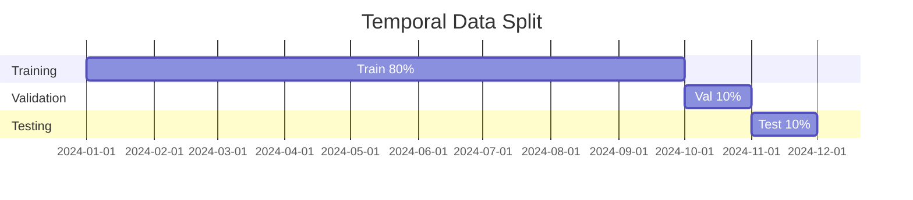

# Dataset Documentation

## Overview

FinTweet-ML uses a multi-source dataset combining financial social media data with market price information to train sentiment-driven trading models.

| Property | Value |
|----------|-------|
| **Primary Sources** | Twitter (financial accounts) + Interactive Brokers (OHLCV) |
| **Time Period** | 2024-2025 |
| **Total Samples** | ~35,000 enriched tweets |
| **Target Variable** | 3-class classification (BUY/HOLD/SELL) |

---

## Data Sources



### 1. Twitter Financial Tweets

**Source Accounts:**
- @StockMKTNewz
- @wallstengine
- @amitisinvesting
- @AIStockSavvy
- @fiscal_ai
- @EconomyApp

**Collection Method:**
- TwitterAPI.io for tweet fetching
- Rate-limited requests (0.2s delay)
- 100 tweets per API call

**Tweet Processing:**
- Text cleaning and normalization
- Ticker symbol extraction (`$AAPL`, `$MSFT`, etc.)
- Category classification (Earnings, M&A, Breaking News, etc.)
- Timestamp conversion: UTC → US Eastern Time

### 2. Market Data (Interactive Brokers)

**Coverage:**
- S&P 500 and Russell 1000 tickers
- ~1,000+ unique symbols

**Data Types:**
| Type | Bar Size | Use Case |
|------|----------|----------|
| Daily OHLCV | 1 day | Technical indicators, daily returns |
| Intraday | 15 minutes | Price at tweet time, hourly returns |

**Storage Format:** Apache Feather (fast I/O)

---

## Data Processing Pipeline



### Key Processing Steps

1. **Timezone Validation**
   - All timestamps normalized to US Eastern Time (ET)
   - Market session classification: `premarket`, `regular`, `afterhours`, `closed`

2. **Look-Ahead Bias Prevention**
   - Price data fetched up to (not including) tweet timestamp
   - Technical indicators computed using only historical data
   - Strict separation of features vs. targets

3. **Data Leakage Checks**
   - No future price information in features
   - Temporal train/validation/test splits
   - Explicit exclusion list for future-looking columns

---

## Feature Engineering



### Numerical Features (10 total)

| Feature | Description | Lookback |
|---------|-------------|----------|
| `volatility_7d` | 7-day price volatility | 7 days |
| `relative_volume` | Volume vs. 20-day average | 20 days |
| `rsi_14` | Relative Strength Index | 14 days |
| `distance_from_ma_20` | Distance from 20-day MA | 20 days |
| `return_5d` | 5-day momentum | 5 days |
| `return_20d` | 20-day momentum | 20 days |
| `above_ma_20` | Binary: price > MA20 | 20 days |
| `slope_ma_20` | MA20 trend direction | 20 days |
| `gap_open` | Overnight gap | 1 day |
| `intraday_range` | Day's high-low range | 1 day |

### Categorical Features (5 total)

| Feature | Description | Cardinality |
|---------|-------------|-------------|
| `author` | Tweet source account | ~6 accounts |
| `category` | News category (Earnings, M&A, etc.) | 12 categories |
| `market_regime` | Trending/Volatile/Calm | 4 regimes |
| `sector` | Stock sector (GICS) | 11 sectors |
| `market_cap_bucket` | Mega/Large/Mid/Small | 4 buckets |

### Text Feature

- Raw tweet text processed by FinBERT
- Max length: 128 tokens
- Pre-trained financial sentiment embeddings

---

## Label Generation



### Target: `label_1d_3class`

1-day forward return classified into 3 classes:

| Class | Condition | Interpretation |
|-------|-----------|----------------|
| **BUY** | Return > +0.5% | Bullish signal |
| **HOLD** | -0.5% ≤ Return ≤ +0.5% | Neutral |
| **SELL** | Return < -0.5% | Bearish signal |

### Why 1-Day Labels?

- Less noisy than 1-hour returns
- Captures meaningful price moves
- Aligns with typical news impact window

---

## Data Quality

### Reliability Filters



Samples are marked as "reliable" when:
- Valid price at tweet time
- Valid forward price for return calculation
- Market was open (not weekend/holiday)
- No data gaps in intraday bars

### Quality Metrics

| Metric | Typical Value |
|--------|---------------|
| Reliability rate | 56-70% |
| Missing prices | ~5% |
| Market closed tweets | ~30% |

---

## Train/Validation/Test Split

### Strategy: Temporal Split (80/10/10)



**Why Temporal Split?**
- Prevents data leakage from future to past
- Simulates real-world deployment scenario
- Tests true generalization to unseen time periods

**Split Ratios:**
- Train: 80%
- Validation: 10%
- Test: 10%

### Distribution Shift Analysis

The 80/10/10 split was chosen to minimize class distribution shift:

| Split | Train→Test SELL Shift |
|-------|----------------------|
| 70/15/15 | +9.0% (bad) |
| **80/10/10** | **+2.6%** (acceptable) |

---

## Excluded Columns

These columns are explicitly excluded from features to prevent leakage:

```python
EXCLUDED_FROM_FEATURES = [
    "spy_return_1d",      # Uses future SPY close
    "spy_return_1hr",     # Future SPY movement
    "return_1hr",         # Target variable
    "return_to_next_open",# Target variable
    "entry_price",        # Execution price
    "exit_price_1hr",     # Future price
    "price_next_open",    # Future price
    "label_3class",       # Target (backup)
    "label_1d_3class",    # Target (primary)
]
```

---

## Data Files

| File | Description |
|------|-------------|
| `data/tweets.db` | SQLite database with raw tweets |
| `data/daily/*.feather` | Daily OHLCV per ticker |
| `data/intraday/*.feather` | 15-min bars per ticker |
| `output/*.csv` | Enriched datasets (gitignored) |
