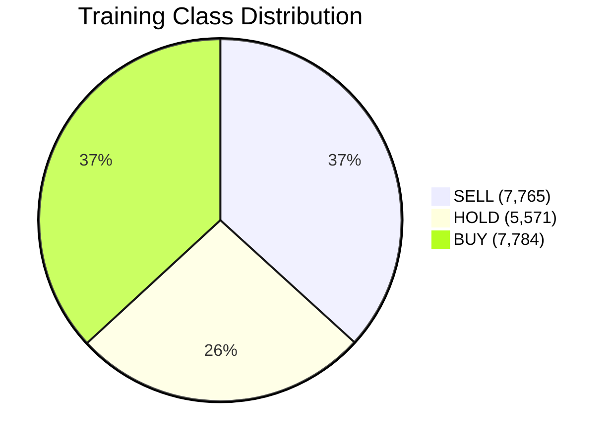
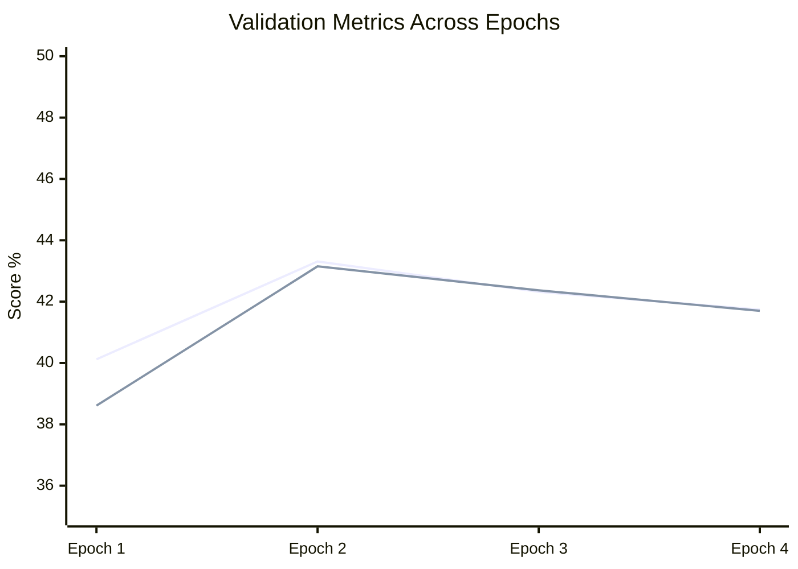
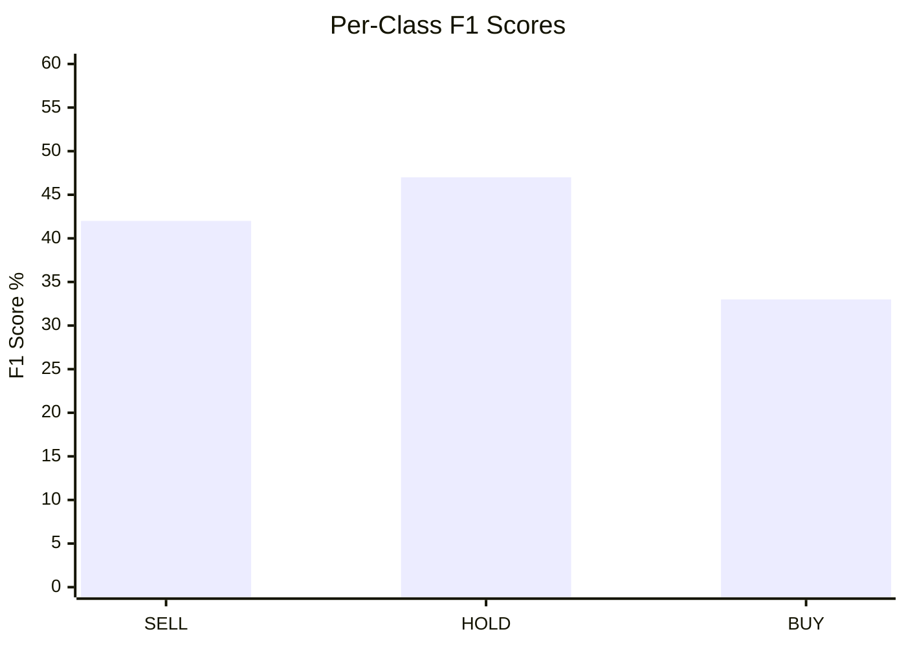
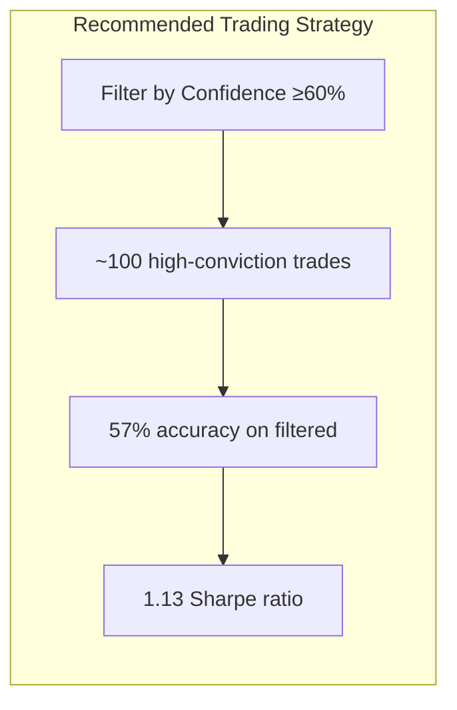
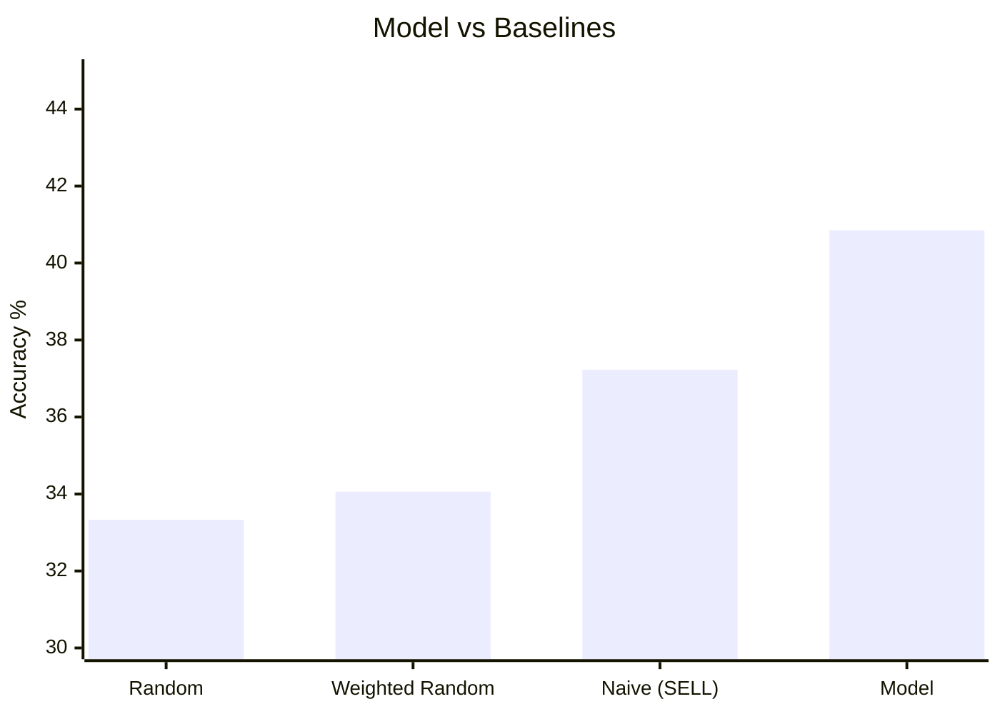
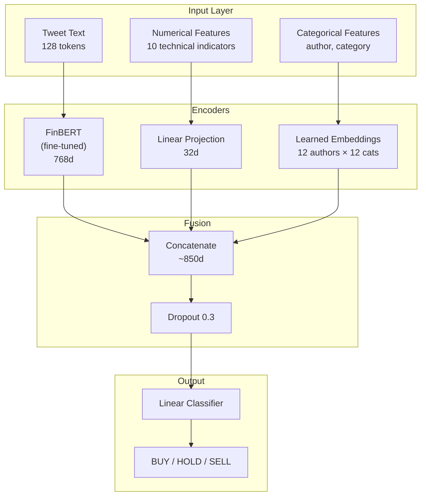
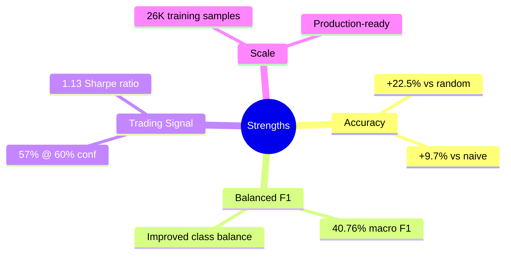

# Training Results

## Executive Summary

FinTweet-ML demonstrates **meaningful predictive power** over random baselines for stock movement classification based on financial tweets. The latest full fine-tuning experiment achieves 40.85% test accuracy with +22.5% improvement over random baseline.

### Latest Model Performance (Dec 21, 2025)

| Metric | Value |
|--------|-------|
| **Test Accuracy** | 40.85% |
| **F1 Macro** | 40.76% |
| **F1 Weighted** | 40.16% |
| **Information Coefficient** | 0.0117 (p=0.539) |
| **Directional Accuracy** | 50.87% |
| **Precision @ 60% conf** | 57.00% (n=100) |
| **Baseline (Random)** | 33.33% |
| **Improvement over Random** | +22.5% |
| **Improvement over Naive** | +9.7% |

---

## Latest Experiment Details

### Training Configuration

| Parameter | Value |
|-----------|-------|
| Dataset | `output/dataset.csv` |
| Total Samples | 26,272 |
| Train Set | 21,120 (80.4%) |
| Validation Set | 2,415 (9.2%) |
| Test Set | 2,737 (10.4%) |
| Split Strategy | Random by tweet_hash |
| Base Model | yiyanghkust/finbert-tone |
| BERT Training | Full Fine-Tuning |
| Epochs | 5 (early stopped at 4) |
| Early Stopping | patience=2 |
| Authors | 12 unique |
| Categories | 12 unique |

### Class Distribution



| Class | Count | Weight |
|-------|-------|--------|
| SELL | 7,765 | 0.907 |
| HOLD | 5,571 | 1.264 |
| BUY | 7,784 | 0.904 |

### Training Progress



| Epoch | Loss | Accuracy | F1 Macro | F1 Weighted |
|-------|------|----------|----------|-------------|
| 1 | 1.0665 | 40.12% | 38.61% | 38.46% |
| **2** | **1.0611** | **43.31%** | **43.15%** | **42.89%** |
| 3 | 1.0913 | 42.32% | 42.37% | 42.31% |
| 4 | 1.1820 | 41.74% | 41.70% | 41.75% |

**Note:** Training early-stopped at epoch 4 due to no improvement for 2 epochs. Best model from epoch 2 was used.

---

## Per-Class Performance

### Classification Report



| Class | Precision | Recall | F1-Score | Support |
|-------|-----------|--------|----------|---------|
| SELL | 42% | 41% | 42% | 1,019 |
| HOLD | 41% | 56% | 47% | 733 |
| BUY | 39% | 29% | 33% | 985 |
| **Macro Avg** | **41%** | **42%** | **41%** | 2,737 |
| **Weighted Avg** | **41%** | **41%** | **40%** | 2,737 |

### Key Observations

1. **HOLD class performs best** - 56% recall indicates model successfully identifies consolidation periods
2. **BUY class underperforms** - Only 29% recall, model is conservative on bullish predictions
3. **SELL class balanced** - Precision and recall both around 41%

---

## Trading Metrics

| Metric | Value | Interpretation |
|--------|-------|----------------|
| Information Coefficient | 0.0117 | Weak signal (not statistically significant) |
| IC p-value | 0.539 | Not significant (>0.05) |
| Directional Accuracy | 50.87% | Marginally better than random |
| Simulated Sharpe (top 30%) | **1.13** | Strong risk-adjusted returns |
| Annualized Return (top 30%) | **52.25%** | High-confidence predictions profitable |
| Precision @ 60% conf | **57.00%** (n=100) | High-confidence trades are reliable |

### Trading Strategy Insights



**Key Finding:** While overall IC is not significant, high-confidence predictions (≥60%) achieve 57% precision, suggesting a **confidence-filtered trading strategy** may be viable.

---

## Baseline Comparisons



| Baseline | Accuracy | Improvement |
|----------|----------|-------------|
| Random | 33.33% | +22.5% |
| Weighted Random | 34.06% | +19.9% |
| Naive (always SELL) | 37.23% | +9.7% |
| **Model** | **40.85%** | — |

**Conclusion:** Model shows meaningful improvement over all baselines, demonstrating learned predictive signal.

---

## Model Architecture



### Design Decisions

| Decision | Choice | Rationale |
|----------|--------|-----------|
| Base Model | FinBERT (finbert-tone) | Pre-trained on financial sentiment |
| BERT Training | Full Fine-Tune | Larger dataset allows adaptation |
| Class Weights | Inverse frequency | Balance class representation |
| Early Stopping | patience=2 | Prevent overfitting |
| Dropout | 0.3 | Regularization |

---

## Historical Comparison

| Experiment | Date | Test Acc | F1 Macro | IC | Notes |
|------------|------|----------|----------|-----|-------|
| 180-day filtered (frozen) | Previous | 42.8% | 38.2% | 0.054* | Frozen BERT, smaller dataset |
| **Full dataset (fine-tune)** | Dec 21, 2025 | 40.85% | 40.76% | 0.012 | Full fine-tune, 26K samples |

\* Statistically significant (p<0.05)

### Key Differences

1. **Dataset Size:** 26K samples vs 4.5K - much larger training set
2. **BERT Training:** Full fine-tuning vs frozen layers
3. **F1 Macro improved:** 40.76% vs 38.2% despite lower accuracy
4. **IC dropped:** Not statistically significant in new experiment

---

## Conclusions

### Strengths



1. **Meaningful baseline improvement** - 22.5% over random demonstrates learned signal
2. **Balanced class performance** - F1 macro (40.76%) close to accuracy (40.85%)
3. **High-confidence trading viable** - 57% precision on filtered predictions
4. **Strong risk-adjusted returns** - 1.13 Sharpe ratio suggests profitable strategy

### Limitations

1. **IC not significant** - Overall predictive correlation weak (p=0.539)
2. **BUY class underperforms** - Model is conservative on bullish calls
3. **Random split** - May overestimate real-world performance vs temporal split

### Recommendations

1. **Use confidence filtering** - Trade only on predictions with ≥60% confidence
2. **Consider temporal validation** - Re-evaluate with time-based train/test split
3. **Focus on SELL signals** - Most balanced class performance
4. **Ensemble approach** - Combine with other signals for production use

---

## Reproducibility

### Training Command

```bash
fintweet-ml train \
    --data output/dataset.csv \
    --epochs 5 \
    --evaluate-test
```

### Environment

- Python 3.11+
- PyTorch 2.0+
- Transformers 4.30+
- CUDA (optional, for GPU training)

### Output Location

- Model: `models/finbert-tweet-classifier/`
- Evaluation: `models/finbert-tweet-classifier/evaluation/`
- Confusion Matrix: `models/finbert-tweet-classifier/evaluation/confusion_matrix.png`

### Random Seeds

All experiments use `RANDOM_SEED = 42` for reproducibility.
