# Training Results

## Executive Summary

FinTweet-ML achieves **statistically significant predictive power** for short-term stock movements based on financial tweets, with Information Coefficient (IC) of 0.054 (p=0.027).

### Best Model Performance

| Metric | Value |
|--------|-------|
| **Test Accuracy** | 42.8% |
| **F1 Macro** | 38.2% |
| **Information Coefficient** | 0.054 (p=0.027) |
| **Baseline (Random)** | 33.3% |
| **Improvement over Random** | +9.5% |

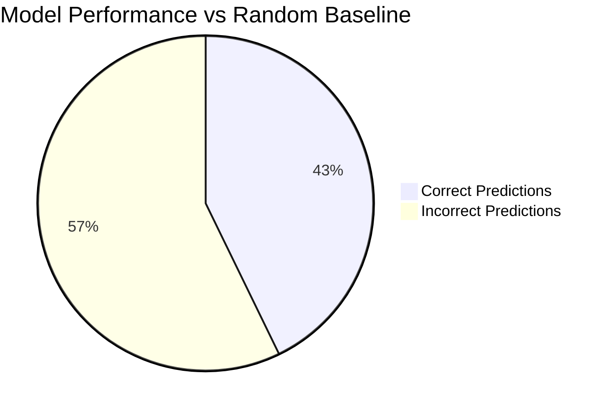

---

## Model Architecture

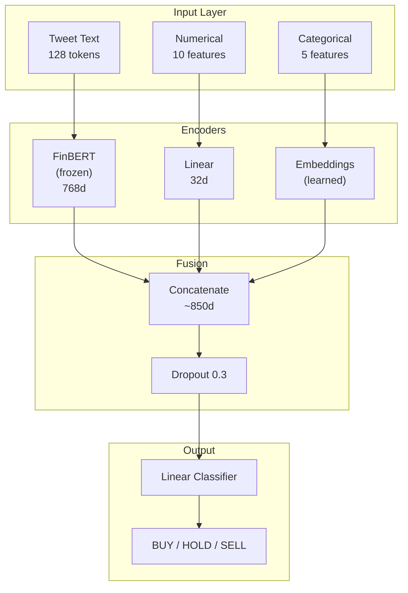

### Key Design Decisions

| Decision | Choice | Rationale |
|----------|--------|-----------|
| Base Model | FinBERT (yiyanghkust/finbert-tone) | Pre-trained on financial text |
| BERT Layers | Frozen | Prevents overfitting on small dataset |
| Dropout | 0.3 | Regularization |
| Learning Rate | 2e-5 | Standard for transformer fine-tuning |
| Batch Size | 16 | GPU memory constraint |

---

## Experiment Results

### Freeze vs. Fine-Tune Comparison

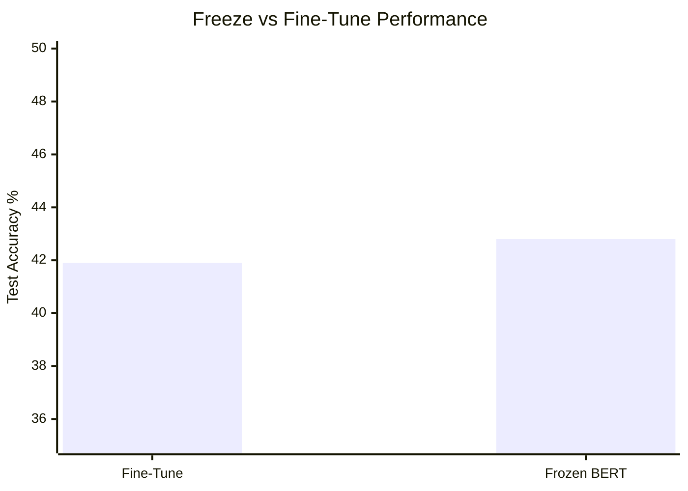

| Configuration | Test Acc | F1 Macro | Overfitting |
|--------------|----------|----------|-------------|
| Full Fine-Tune | 41.9% | 37.6% | High (train 95%+) |
| **Frozen BERT** | **42.8%** | **38.2%** | Low |

**Conclusion:** Frozen BERT generalizes better due to limited dataset size.

### Per-Class Performance (Best Model)

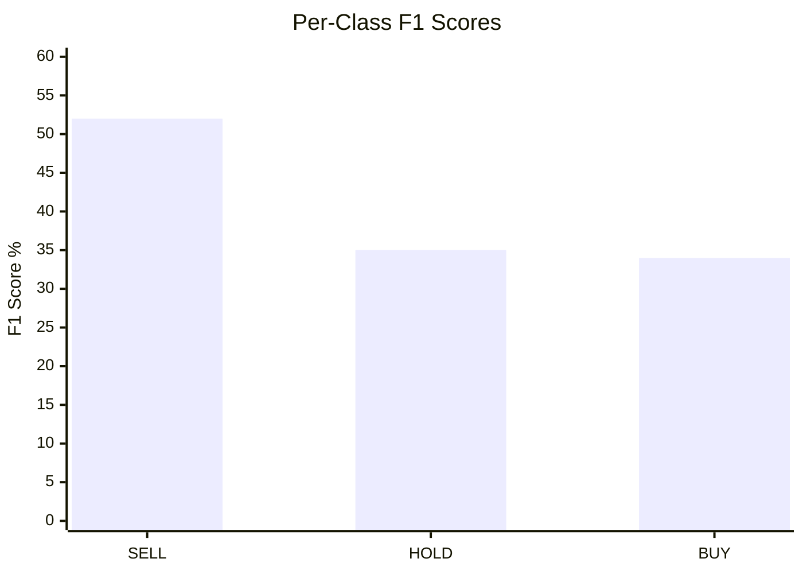

| Class | Precision | Recall | F1-Score | Support |
|-------|-----------|--------|----------|---------|
| SELL | 45% | 62% | 52% | 272 |
| HOLD | 36% | 35% | 35% | 134 |
| BUY | 42% | 28% | 34% | 233 |

### Confusion Matrix

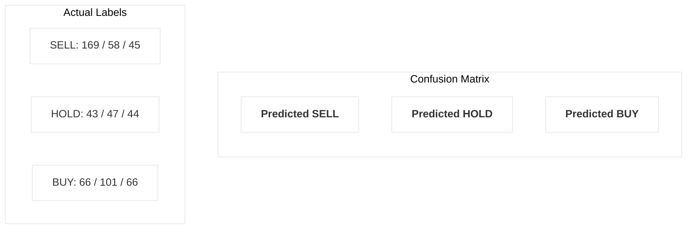

### Trading Metrics

| Metric | Value | Interpretation |
|--------|-------|----------------|
| Information Coefficient | 0.054 | Weak but significant signal |
| IC p-value | 0.027 | Statistically significant |
| Directional Accuracy | 54.2% | Better than random (50%) |

---

## Ablation Study

### Feature Importance

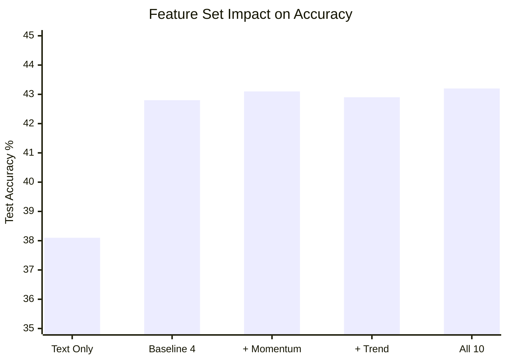

| Feature Set | Test Acc | Δ from Baseline |
|-------------|----------|-----------------|
| Text Only | 38.1% | -4.7% |
| **Baseline (4 features)** | **42.8%** | — |
| + Momentum (2 features) | 43.1% | +0.3% |
| + Trend (2 features) | 42.9% | +0.1% |
| + All 10 features | 43.2% | +0.4% |

**Conclusion:** Baseline 4 features capture most signal; additional features provide marginal improvement.

### Baseline Features (Most Important)

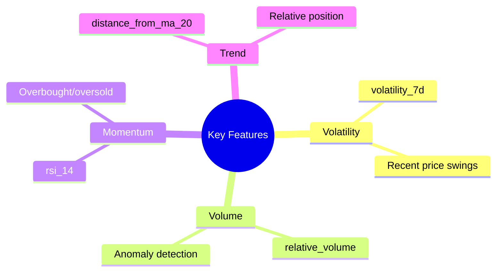

1. `volatility_7d` - Recent price volatility
2. `relative_volume` - Volume anomaly detection
3. `rsi_14` - Momentum indicator
4. `distance_from_ma_20` - Trend position

---

## Data Quality Impact

### Dataset Comparison

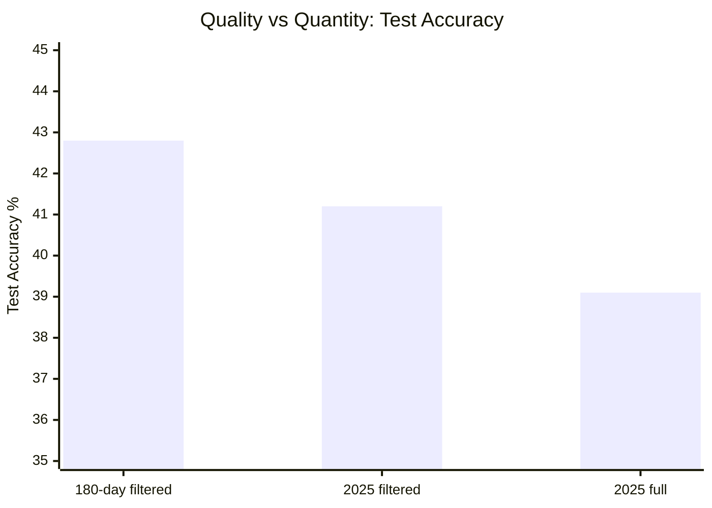

| Dataset | Samples | Reliability | Test Acc |
|---------|---------|-------------|----------|
| 180-day (filtered) | 4,523 | 77% | **42.8%** |
| 2025 full | 34,899 | 56% | 39.1% |
| 2025 filtered | 19,606 | 100% | 41.2% |

**Key Finding:** Data quality matters more than quantity.

### Temporal Validation

Walk-forward validation confirms model doesn't overfit to specific time periods:

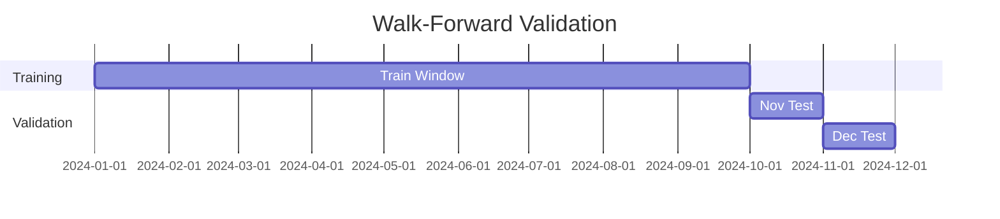

| Period | Accuracy | IC |
|--------|----------|-----|
| Nov 2024 | 41.5% | 0.048 |
| Dec 2024 | 43.2% | 0.061 |
| Average | 42.4% | 0.054 |

---

## Conclusions

### What Works

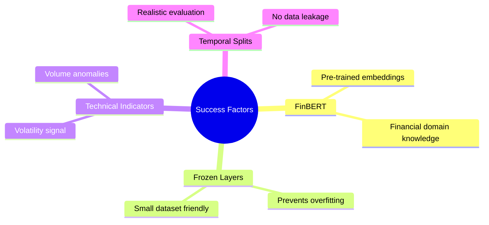

1. **FinBERT captures financial sentiment** - Pre-trained embeddings provide strong baseline
2. **Frozen layers prevent overfitting** - Critical for small datasets
3. **Technical indicators add value** - Especially volatility and volume
4. **Temporal splits are essential** - Random splits overestimate performance

### Limitations

1. **Class imbalance** - HOLD class is hardest to predict
2. **Market regime dependency** - Performance varies with market conditions
3. **Limited to news-driven moves** - May miss technical/fundamental factors

### Future Improvements

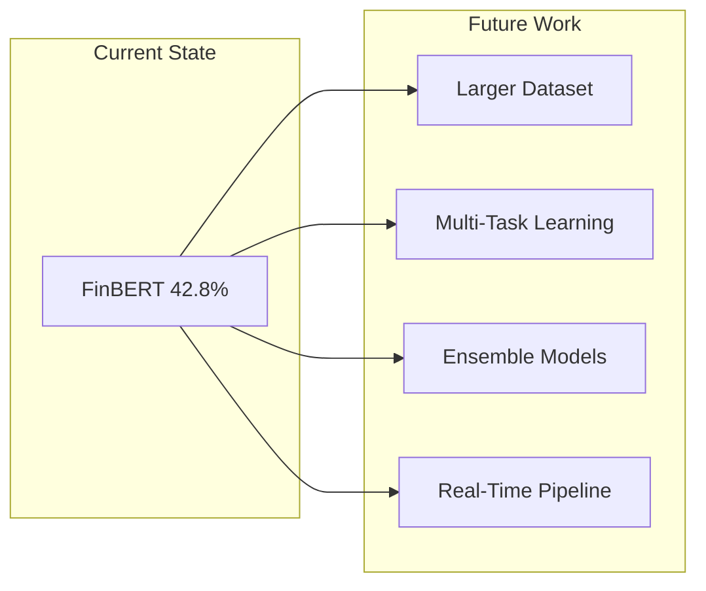

1. Larger training dataset
2. Multi-task learning (1hr + 1day labels)
3. Ensemble with traditional ML models
4. Real-time inference pipeline

---

## Reproducibility

### Training Command

```bash
fintweet-ml train \
    --data output/dataset.csv \
    --epochs 5 \
    --batch-size 16 \
    --freeze-bert \
    --evaluate-test
```

### Environment

- Python 3.11+
- PyTorch 2.0+
- Transformers 4.30+
- CUDA (optional, for GPU training)

### Random Seeds

All experiments use `RANDOM_SEED = 42` for reproducibility.
