# FinBERT Tweet Classifier - Training Results

> **Date**: December 2025  
> **Dataset**: 42,749 financial tweets  
> **Model**: FinBERT MultiModal (yiyanghkust/finbert-tone)  
> **Task**: 3-class classification (SELL, HOLD, BUY)

---

## 📊 Executive Summary

Three model variants were trained with different hyperparameters. Key finding: **Better classification accuracy does not equal better trading performance**.

```mermaid
quadrantChart
    title Model Trade-offs: Classification vs Trading
    x-axis Low Accuracy --> High Accuracy
    y-axis Poor Trading --> Good Trading
    quadrant-1 Ideal (neither achieved)
    quadrant-2 Good Trading, Low Accuracy
    quadrant-3 Poor at Both
    quadrant-4 High Accuracy, Poor Trading
    V1: [0.55, 0.45]
    V2: [0.45, 0.75]
    V3: [0.65, 0.15]
```

| Aspect | Recommended Model |
|--------|-------------------|
| **Classification Accuracy** | V3 (41.92%) |
| **Trading Profitability** | V2 (Sharpe: -0.03) |
| **Statistical Significance** | V1 (IC p=0.025) |
| **Overall Best** | **V1** (balanced) |

---

## 🧪 Experiment Configurations

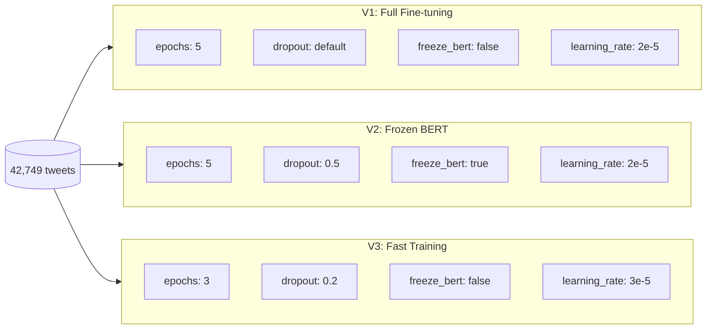

### Common Parameters

| Parameter | Value |
|-----------|-------|
| Temporal Split | 80% train / 10% val / 10% test |
| Train samples | 34,199 |
| Validation samples | 4,275 |
| Test samples | 4,275 |
| Early stopping patience | 2 epochs |
| BUY weight boost | 1.2x |
| Base model | yiyanghkust/finbert-tone |

### Class Distribution (Training Set)

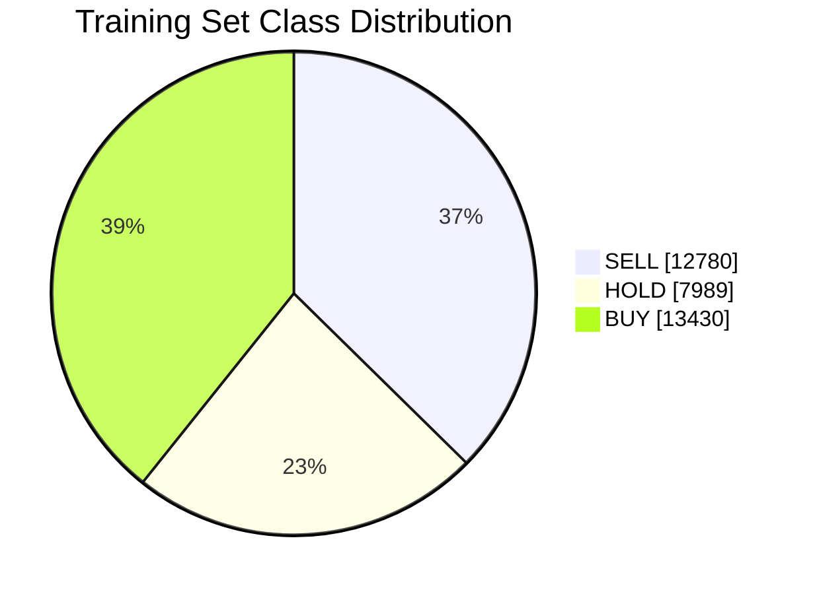

---

## 📈 Training Curves

### V1: Full Fine-tuning (5 epochs)

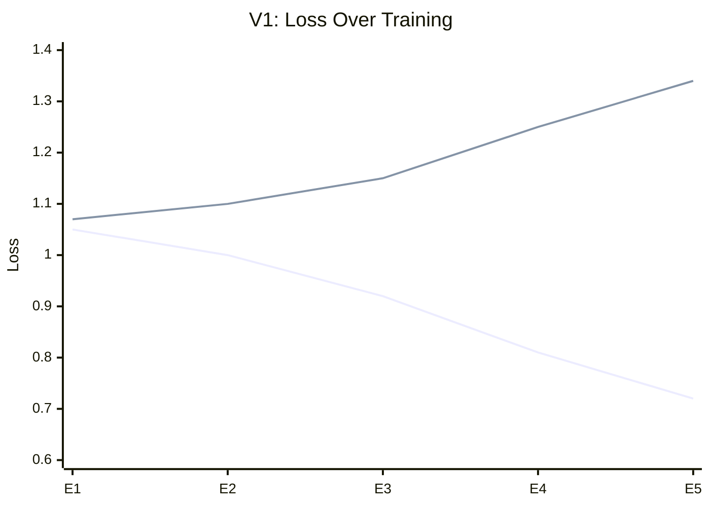

⚠️ **Severe overfitting**: Train loss decreases while validation loss increases

### V2: Frozen BERT (5 epochs)

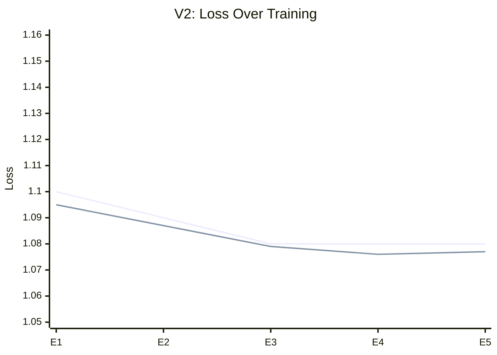

✅ **No overfitting**: Losses track together, but model barely learns (plateaus at ~1.08)

### V3: Fast Training (3 epochs)

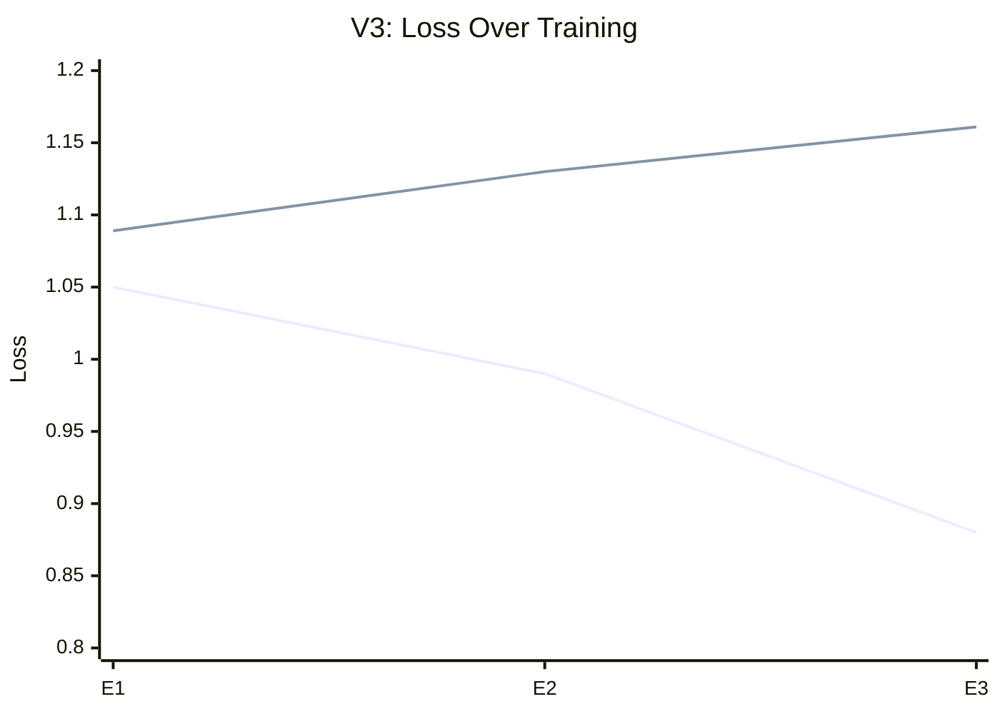

⚠️ **Moderate overfitting**: Similar pattern to V1 but less severe

---

## 🎯 Classification Performance

### Test Set Metrics Comparison

| Metric | V1 | V2 | V3 | Best |
|--------|-----|-----|-----|------|
| **Accuracy** | 40.84% | 40.23% | **41.92%** | V3 |
| **F1 (macro)** | 40.92% | 33.89% | **41.42%** | V3 |
| **F1 (weighted)** | 40.74% | 32.64% | 40.73% | V1 |

```mermaid
xychart-beta
    title "Test Set Performance Comparison"
    x-axis ["V1", "V2", "V3"]
    y-axis "Score (%)" 30 --> 45
    bar "Accuracy" [40.84, 40.23, 41.92]
    bar "F1 Macro" [40.92, 33.89, 41.42]
```

### Per-Class Performance

#### V1: Full Fine-tuning
```
              precision    recall  f1-score   support
        SELL       0.42      0.36      0.38      1595
        HOLD       0.39      0.46      0.43      1147
         BUY       0.41      0.42      0.42      1533
    accuracy                           0.41      4275
```

#### V2: Frozen BERT
```
              precision    recall  f1-score   support
        SELL       0.46      0.04      0.07      1595  ← Almost never predicts SELL!
        HOLD       0.44      0.43      0.43      1147
         BUY       0.39      0.76      0.51      1533  ← Over-predicts BUY
    accuracy                           0.40      4275
```

#### V3: Fast Training
```
              precision    recall  f1-score   support
        SELL       0.45      0.25      0.32      1595
        HOLD       0.42      0.55      0.48      1147
         BUY       0.40      0.50      0.45      1533
    accuracy                           0.42      4275
```

### Per-Class Recall Comparison

```mermaid
xychart-beta
    title "Recall by Class"
    x-axis ["SELL", "HOLD", "BUY"]
    y-axis "Recall (%)" 0 --> 80
    bar "V1" [36, 46, 42]
    bar "V2" [4, 43, 76]
    bar "V3" [25, 55, 50]
```

**Key Insight**: V2 essentially collapsed to always predicting BUY (76% recall) and ignoring SELL (4% recall).

---

## 💰 Trading Metrics

### Critical Trading Performance

| Metric | V1 | V2 | V3 | Best |
|--------|-----|-----|-----|------|
| **Information Coefficient** | 0.034 | 0.028 | 0.015 | V1 |
| **IC p-value** | **0.025** ✅ | 0.066 | 0.320 ❌ | V1 |
| **Directional Accuracy** | 52.10% | 49.48% | 52.03% | V1 |
| **Sharpe Ratio** | -0.18 | **-0.03** | -0.77 | V2 |
| **Annualized Return** | -11.71% | **-1.73%** | -47.11% | V2 |

```mermaid
xychart-beta
    title "Trading Metrics Comparison"
    x-axis ["V1", "V2", "V3"]
    y-axis "Value" -50 --> 55
    bar "Directional Acc (%)" [52.1, 49.5, 52.0]
    bar "Ann. Return (%)" [-11.7, -1.7, -47.1]
```

### Sharpe Ratio Comparison

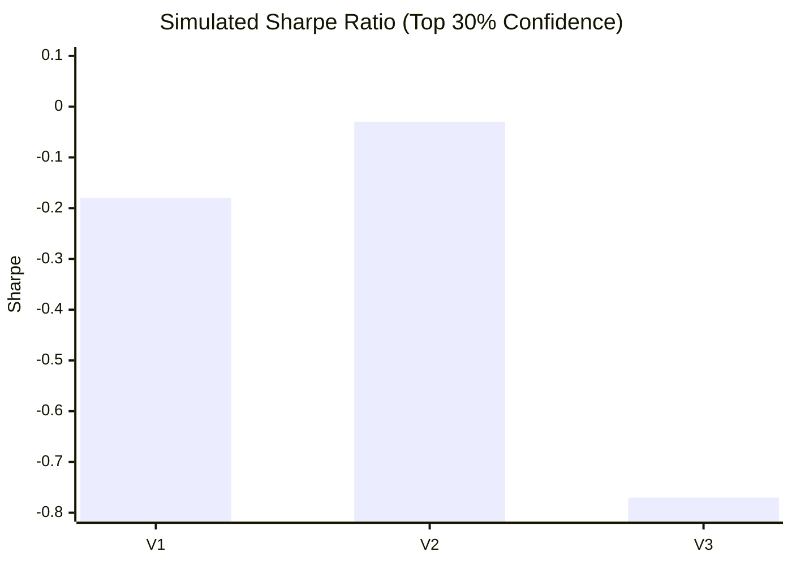

⚠️ **All models have negative Sharpe ratios** - none would be profitable for trading.

### Statistical Significance

```mermaid
flowchart TD
    subgraph IC["Information Coefficient Analysis"]
        V1IC["V1: IC = 0.034<br/>p = 0.025 ✅"]
        V2IC["V2: IC = 0.028<br/>p = 0.066 ⚠️"]
        V3IC["V3: IC = 0.015<br/>p = 0.320 ❌"]
    end
    
    V1IC --> SIG["Statistically Significant<br/>(p < 0.05)"]
    V2IC --> MARGINAL["Marginally Significant<br/>(p < 0.10)"]
    V3IC --> NOSIG["Not Significant<br/>(p > 0.10)"]
```

---

## 🔬 Key Findings

### The Accuracy-Trading Paradox

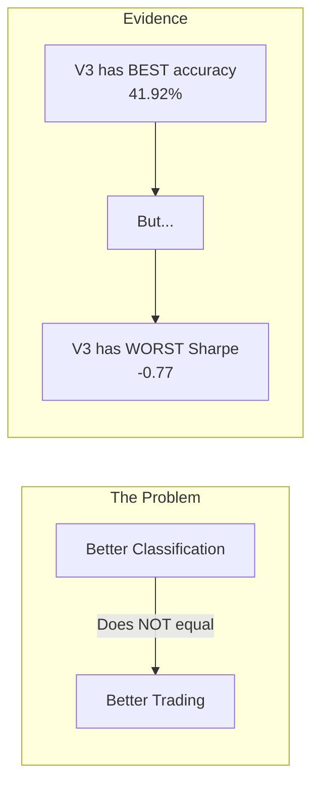

### Model Behavior Analysis

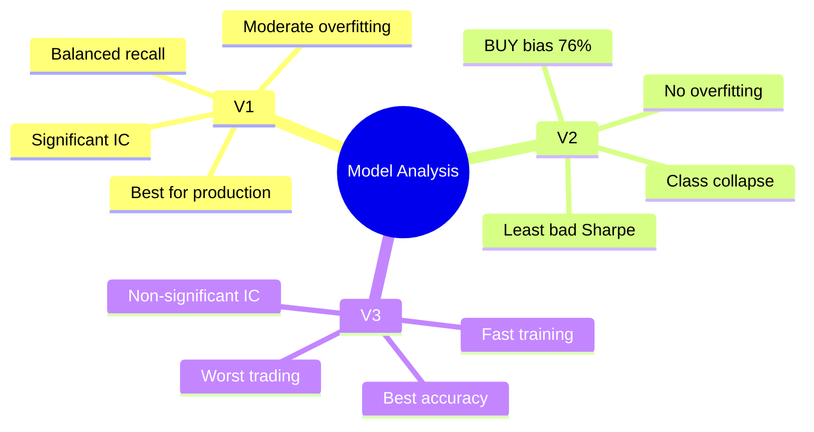

---

## 📋 Detailed Results

### V1: Full Fine-tuning

**Configuration:**
```bash
fintweet-ml train \
    --data output/dataset.csv \
    --epochs 5 \
    --temporal-split \
    --evaluate-test \
    --early-stopping-patience 2 \
    --buy-weight-boost 1.2 \
    --output-dir models/all-tweets
```

**Training Time:** 1h 40m 54s

**Epoch-by-Epoch Validation:**
| Epoch | Val Loss | Val Accuracy | Val F1 (macro) |
|-------|----------|--------------|----------------|
| 1 | 1.070 | 35.2% | 35.1% |
| 2 | 1.099 | 34.9% | 32.9% |
| 3 | 1.145 | 38.3% | 37.6% |
| 4 | 1.246 | 37.9% | 37.2% |
| 5 | 1.339 | 39.5% | 38.3% |

---

### V2: Frozen BERT

**Configuration:**
```bash
fintweet-ml train \
    --data output/dataset.csv \
    --epochs 5 \
    --temporal-split \
    --evaluate-test \
    --early-stopping-patience 2 \
    --buy-weight-boost 1.2 \
    --output-dir models/all-tweets-v2 \
    --freeze-bert \
    --dropout 0.5
```

**Training Time:** 36m 36s (3x faster due to frozen BERT)

**Epoch-by-Epoch Validation:**
| Epoch | Val Loss | Val Accuracy | Val F1 (macro) |
|-------|----------|--------------|----------------|
| 1 | 1.095 | 33.4% | 26.9% |
| 2 | 1.087 | 32.9% | 26.8% |
| 3 | 1.079 | 33.4% | 27.6% |
| 4 | 1.076 | 32.9% | 27.1% |
| 5 | 1.077 | 33.0% | 27.1% |

---

### V3: Fast Training

**Configuration:**
```bash
fintweet-ml train \
    --data output/dataset.csv \
    --epochs 3 \
    --temporal-split \
    --evaluate-test \
    --early-stopping-patience 2 \
    --buy-weight-boost 1.2 \
    --output-dir models/all-tweets-v3 \
    --dropout 0.2 \
    --learning-rate 3e-5
```

**Training Time:** 58m 43s

**Epoch-by-Epoch Validation:**
| Epoch | Val Loss | Val Accuracy | Val F1 (macro) |
|-------|----------|--------------|----------------|
| 1 | 1.089 | 34.0% | 32.8% |
| 2 | 1.130 | 34.8% | 31.9% |
| 3 | 1.161 | 38.8% | 38.2% |

---

## 🎯 Recommendations

### For Production Use

```mermaid
flowchart TD
    A{Use Case?} -->|Classification| B[Use V3]
    A -->|Trading Signals| C[Use V1]
    A -->|Low Risk| D[Use V2]
    
    B --> B1[Highest accuracy<br/>41.92%]
    C --> C1[Only significant IC<br/>p=0.025]
    D --> D1[Least negative Sharpe<br/>-0.03]
    
    C1 --> WARN[⚠️ Still not profitable]
    D1 --> WARN
```

### Future Improvements

1. **Address Overfitting**
   - Use early stopping based on validation loss (stop at epoch 1-2)
   - Add more regularization (weight decay, label smoothing)

2. **Improve Trading Signal**
   - Train on return prediction (regression) instead of classification
   - Use asymmetric loss functions
   - Focus on high-confidence predictions only (>70%)

3. **Data Quality**
   - Review how SELL/HOLD/BUY labels are generated
   - Consider different return thresholds
   - Add more features (sentiment, market context)

---

## 📁 Model Artifacts

| Model | Path | Size |
|-------|------|------|
| V1 | `models/all-tweets/` | ~440 MB |
| V2 | `models/all-tweets-v2/` | ~440 MB |
| V3 | `models/all-tweets-v3/` | ~440 MB |

Each directory contains:
- `pytorch_model.bin` - Model weights
- `model_config.json` - Configuration
- `scaler.joblib` - Feature scaler
- `encodings.json` - Categorical encodings
- `evaluation/` - Metrics and confusion matrix

---

*Generated: December 23, 2025*

